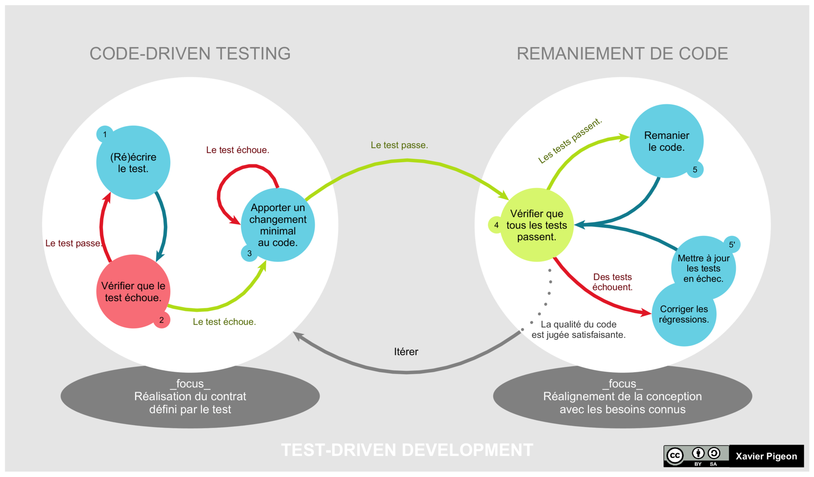

# WORKSHOP TESTS UNITAIRES ET INTEGRATION

## PREREQUIS

- Apache Maven 3.5+ [Download](https://maven.apache.org/download.cgi)
- Java JDK 1.8+ [AdoptOpenJDK](https://adoptopenjdk.net/)
- PostgreSQL 10 [Download](https://www.postgresql.org/download/)

## OUTILS

- GIT: SmartGit [SmartGit – Git Client for Windows, macOS, Linux](https://www.syntevo.com/smartgit/)
- IDEs: Eclipse, IntelliJ IDEA Ultimate, VSCode
- PGAdmin 3/4
- Sur Windows: [Cmder](https://cmder.net/)

## CONFIGURATION POSTE DE TRAVAIL

- Installation du fichier de configuration settings.xml dans le répertoire `{user_home}/.m2/` afin de pouvoir accéder au nexus de l'entreprise.

## STEP 0: PROJET

Cloner le projet maven workshop-tests et ouvrez le avec votre IDE. 
Chaque commit correspond à une étape de l'atelier. 

Vous pouvez passer d'un commit à un autre avec: 
`git checkout HEAD~4` pour revenir 4 commits en arrière jusqu'au step 1 par exemple. 

## STEP 1: UNIT TEST

`BusinessLogic`: Un exemple de test unitaire avec [JUnit 5](https://junit.org/junit5/)

- Structure des classes de tests avec JUnit et Maven
- Créer/Voir les classes de tests liées à une classe métier: `CTRL+SHIFT+T`
- Ecrire et Run/Debug un TU

## STEP 2: TDD

Ajout fonctionnalité dans BusinessLogic en Test Driven Development. 

- Loi n°1: Vous devez écrire un test qui échoue avant de pouvoir écrire le code de production correspondant.
- Loi n°2: Vous devez écrire une seule assertion à la fois, qui fait échouer le test ou qui échoue à la compilation.
- Loi n°3: Vous devez écrire le minimum de code de production pour que l'assertion du test actuellement en échec soit satisfaite.

En savoir plus: [Wikipedia](https://fr.wikipedia.org/wiki/Test_driven_development)

## STEP 3: MOCKITO - MOCK

Fonctionnement du framework de mock `mockito`.

## STEP 4: MOCKITO - SPY

Utilisation des Mockito.spy(), ArgumentCaptor, verify(x, times())

## STEP 5: INTEGRATION WITH DAO

Utilisation d'une base de donnée pour les tests d'intégration